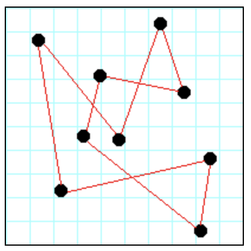

# Traveling Salesman

A simplified version of the travelling salesman problem

## Purposes of this project

- To gain further experience with *Test-Driven-Development* (TDD)
- Solving complex problems with programs
- Further practice using the Travis Continuous Integration (CI) process

## General idea of the project

Suppose there are a number of "cities", as in shown in Figure 1 below:

The distance between any two cities is the standard Euclidean distance, that is,

√((x1-x2)2+(y1-y2)2)

A traveling salesman wishes to visit every city exactly once,
then return to their starting point. (It doesn't matter what city is
the starting point.) Such a path is called a *circuit*,
as in Figure 2 below:

However, the salesman also wishes to minimise the total distance that
must be traveled.

This is a classic computer science problem, known as the
**Traveling Salesman problem**.

Algorithms for finding reasonably good solutions are available on the web,
however, I will use a *hill climbing approach,
where I start with "any" solution, and try to progressively improve
it until I can't improve it any more.*

The final solution is unlikely to be the optimal but that's okay, so long as
it isn't obviously terrible.

### Data representation

`city-data.txt`, contains the latitudes and longitudes of the fifty state
capitals of the U.S.A.
Each line contains:
- the name of the state,
- the name of the city,
- the latitude, and
- the longitude.

This *"road map"* represents the path the salesman follows, starting with the
first city in the list and ending back at the first city in the list.

### Testing

The `pytest` unit testing framework is used to produce the solution to the
Travelling Salesman Problem using Test Driven Development
